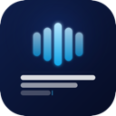
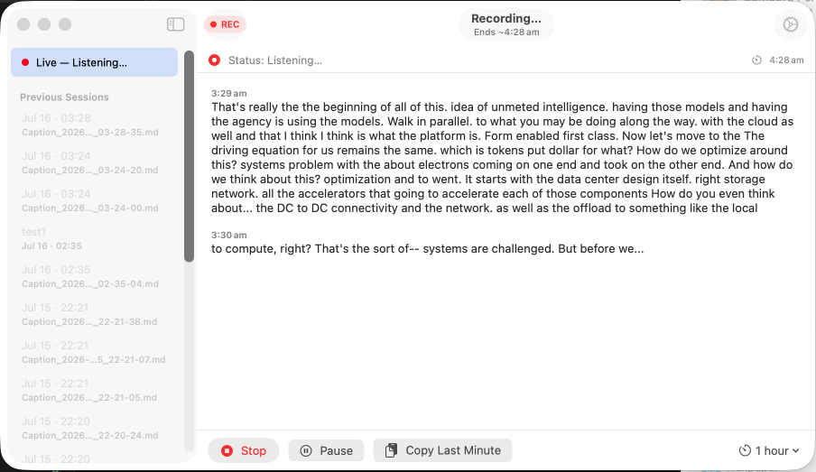
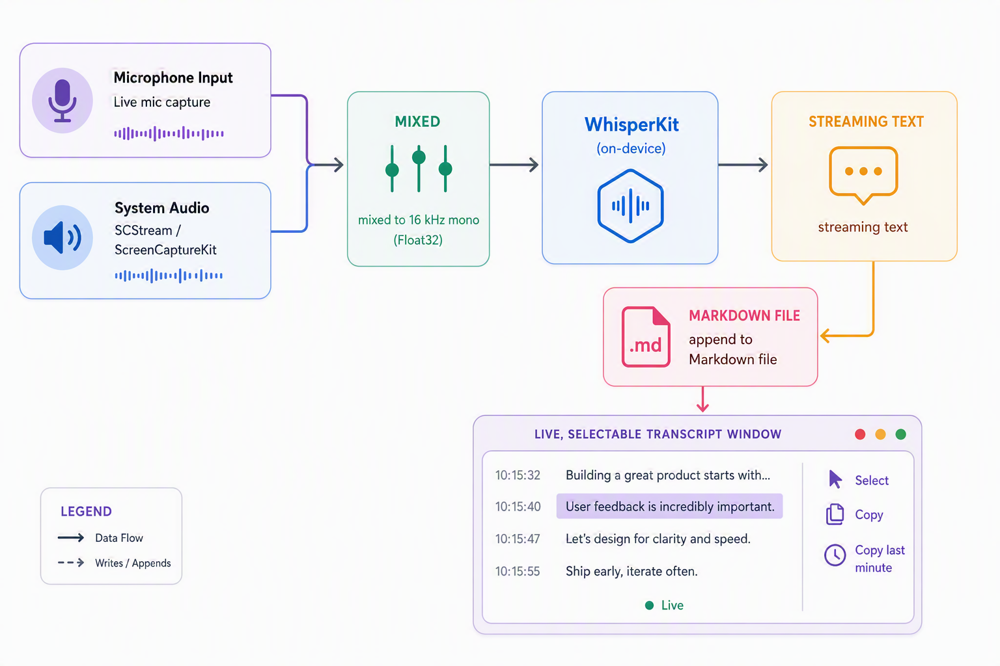

<p align="center">
  
</p>

# LiveScriber

**Real-time, on-device live captioning for macOS that writes straight to Markdown.**

LiveScriber listens to whatever your Mac is hearing — a Teams/Webex/Zoom call, a
browser video, a live broadcast, a podcast, or your own microphone — and turns it
into a live, scrolling transcript you can select and copy from as it happens.
Every session is saved as a plain Markdown file with timestamped entries, so it
drops perfectly into Obsidian or any notes app.

Everything runs **locally on Apple Silicon** using
[WhisperKit](https://github.com/argmaxinc/WhisperKit). **No cloud. No database.
No account. Nothing leaves your Mac.**

<p align="center">
  
</p>

---

## Why it exists

I take notes in Obsidian as my "second brain." In meetings and live broadcasts I
rarely want to dump a full transcript — I want to follow along, catch the
important points, and copy just those lines into my own notes instead of
re-typing them. I couldn't find an app that did exactly this, so I built one with
the help of Copilot and open-sourced it.

The idea in one line: **never miss a thing in a meeting** — watch the live
captions, and copy across only the bits that matter.

### Good for

- **Meetings** — Teams, Webex, Zoom, Google Meet (captures both the remote
  speakers *and* your mic).
- **Live broadcasts / streams** — grab quotes and ideas as they're said.
- **Podcasts, videos, lectures** — pull highlights without scrubbing back.
- **Accessibility** — a persistent, always-on-top caption window.

---

## Features

- **Live, near real-time transcription** — short audio chunks are decoded on a
  background task so text appears with minimal delay.
- **Captures system audio *and* microphone** — system audio via
  ScreenCaptureKit's `SCStream` grabs the mixed output of every running app
  (calls, browser, music). You can run system audio and a mic input at the same
  time.
- **Audio input picker** — choose which input device to use from a dropdown in
  Settings; system-audio capture is a separate toggle.
- **Writes to Markdown as it goes** — each session is a `.md` file named with its
  date/time, transcript appended under per-minute `## HH:mm` headings.
- **Menu-bar app** — lives in the top menu bar with no Dock clutter; start a new
  caption straight from the menu.
- **Session browser** — every past session is listed in the left sidebar. Click
  to load it into the main view (when nothing is recording).
- **Rename & delete sessions** — right-click any session to rename it or move it
  to the Trash (reversible).
- **Recording lock** — while a session is live you can't accidentally navigate
  away; starting a caption jumps straight to the active session.
- **Select & copy anything** — the transcript is fully selectable, including
  across minute boundaries, plus a one-click **Copy Last Minute** action.
- **Session time limits** — set an auto-stop of 30 min / 1 h / 2 h / 4 h (or no
  limit); an estimated end time is shown and you can change it mid-session.
- **Always-on-top** — pin the window above everything else (Settings toggle).
- **Global shortcut** — start a new caption with **⌘⇧N** (enable in Settings).
- **Selectable Whisper models** — download on demand and switch between them.

---

## How it works

<p align="center">
  
</p>


All transcription happens on-device. The only file the app writes is the Markdown
transcript for each session.

---

## Models

WhisperKit models are downloaded on demand and cached locally. Available options:

| Model | Notes |
|---|---|
| `openai_whisper-tiny` | Fastest, lowest accuracy |
| `openai_whisper-base` | **Default** — good speed/accuracy balance |
| `openai_whisper-small` | More accurate, slower |
| `openai_whisper-medium` | Higher accuracy |
| `openai_whisper-large-v3-v20240930_turbo` | Large accuracy, tuned for speed |
| `openai_whisper-large-v2` / `openai_whisper-large-v3` | Highest accuracy, heaviest |

Pick a model in **Settings**; the first use of a model downloads it.

---

## Privacy & permissions

LiveScriber runs **without the App Sandbox** so it can capture system audio and
write transcripts to disk. On first launch macOS will ask for:

- **Microphone** — to capture your input device.
- **Screen Recording** — required by ScreenCaptureKit to capture system audio
  (this is how macOS gates system-audio access; no screen content is recorded).

All processing is local. Transcripts are ordinary Markdown files you own.

---

## Install (download a release)

The release binaries are **ad-hoc signed** (built with a free Apple account), so
macOS Gatekeeper will warn that the app "can't be checked for malicious
software." This is expected. To open it:

1. Download `LiveScriber.zip` (or `.dmg`) from the
   [Releases](../../releases) page and unzip it.
2. Move `LiveScriber.app` to `/Applications`.
3. **Right-click** the app → **Open**, then click **Open** in the dialog.
   (Double-clicking will only show a "cannot be opened" error the first time.)

If right-click → Open still won't work (newer macOS), remove the quarantine flag
from Terminal:

```sh
xattr -dr com.apple.quarantine /Applications/LiveScriber.app
```

Then launch it normally. You only need to do this once per download.

---

## Usage

1. Launch LiveScriber — it appears in the **menu bar**.
2. Open the main window and pick your audio source in **Settings**
   (system audio, a mic, or both) and a model.
3. Press **Start** (or **⌘⇧N**) to begin a new session — a timestamped Markdown
   file is created automatically.
4. Watch the live transcript. **Select and copy** any text, or use
   **Copy Last Minute**.
5. Optionally set a **time limit** so the session auto-stops.
6. Press **Stop** to end. The session appears in the left sidebar, where you can
   **click to reopen**, **right-click to rename**, or **delete** it.

Transcripts are saved as Markdown, ready to paste into Obsidian or any notes app.

---

## Build from source

Requirements: macOS with Xcode, and an internet connection (WhisperKit and its
models are fetched on first build/run).

```sh
git clone <this-repo-url>
cd livescriber
open livescriber.xcodeproj
```

Press **Run** in Xcode. By default the project signs **ad-hoc** ("Sign to Run
Locally"), so it builds with no Apple Developer account required.

### Optional: stable local signing

With ad-hoc signing, the code signature changes on every build, so macOS
re-prompts for Microphone / Screen Recording permission each time. To avoid that,
sign with your own Apple Development certificate:

1. Copy the template:
   ```sh
   cp Local.xcconfig.example Local.xcconfig
   ```
2. Fill in your team ID and certificate hash (both are git-ignored):
   ```sh
   security find-identity -v -p codesigning
   ```
   Use the long hex hash as `CODE_SIGN_IDENTITY`, and the certificate's OU as
   `DEVELOPMENT_TEAM`:
   ```sh
   security find-certificate -c "Apple Development" -p | openssl x509 -noout -subject
   ```
3. Build. `Local.xcconfig` overrides the ad-hoc defaults in `Signing.xcconfig`
   and is never committed.

---

## Tech stack

- **Swift + SwiftUI** — native macOS app (menu-bar agent, `NavigationSplitView`).
- **WhisperKit** — on-device speech-to-text on Apple Silicon.
- **AVAudioEngine** — microphone capture, resampled to 16 kHz mono.
- **ScreenCaptureKit (`SCStream`)** — system-audio capture.
- **Combine** — reactive app state.

---

## Roadmap / ideas

Contributions welcome. Some directions being considered:

- Custom, user-assignable keyboard shortcuts.
- Richer multi-device mixing and per-source labelling.
- Speaker segmentation / diarization.
- Export helpers (copy as Markdown block, send to Obsidian).

Have an idea or found a bug? Open an issue or a pull request.

---

## Contributing

Issues and pull requests are welcome. Please keep changes focused and describe
the scenario you're improving.

---

## License

See [LICENSE](LICENSE).
